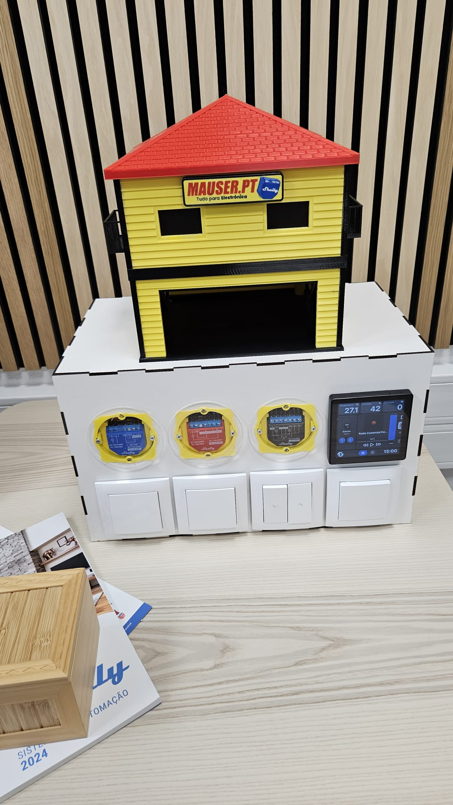

# Shelly Automated Exhibition House

The project is fully completed and operational. However, the documentation is still a work in progress. We are actively working on providing detailed instructions, schematics, and additional information. Please stay tuned for updates.

Welcome to the Automated Exhibition House project! This repository showcases a fully functional smart home setup using Shelly modules. The house is equipped with four Shelly modules, which control the gate, shutters, and lighting, providing an automated and seamless experience.

Watch the demonstration video below:

[Demo Video](https://youtu.be/CE9VABJTA8k)

## Project Overview
This project demonstrates the integration of IoT technology in a modern exhibition house setting. The key features include:

Automated Gate: The gate can be controlled remotely, allowing for easy access and enhanced security.
Smart Shutters: Control the shutters automatically or remotely to adjust the light and privacy levels in the house.
Lighting Control: The house's lighting system is fully automated, providing customized lighting scenes based on time or user preferences.
Modules Used
### Shelly plus 1PM: Utilized for the lighting system, enabling smooth dimming and on/off control.
### Shelly plus 2PM: Deployed for managing the shutters, allowing for both automation and manual control.
### Shelly Plus 1: Used to control the gate, ensuring precise and reliable operation. 
### Shelly wall display: Provides a user-friendly interface for monitoring and controlling the entire system from a central location.

## How It Works
The house is connected through a local Wi-Fi network, where each Shelly module is configured via the Shelly app or a home automation platform like Home Assistant. Users can interact with the system through their smartphones or integrate it with voice assistants for hands-free control.

## Installation
Hardware Setup: Install the Shelly modules in the designated locations (gate, shutters, lights).
Configuration: Connect the modules to your Wi-Fi network using the Shelly app.
Automation: Set up automation rules and schedules based on your preferences.
Monitoring: Use the Shelly app or a home automation dashboard to monitor and control the system.
Contributing
We welcome contributions to enhance this project! Feel free to fork the repository, submit issues, or open pull requests.

## BOM

| Item                | Quantity | Description                  | Size           | Supplier          |   Link                                                                                          |
|:--------------------|:--------:|:-----------------------------|:--------------:|:-----------------:|:-----------------------------------------------------------------------------------------------:|
| Base                |    1     | MDF                          |   1100x500x3mm |        NA         |                                                                                                 |
| Dry Wall Box        |    8     | electrical dry wall box      |     NA         |     Mauser.pt     | https://mauser.pt/catalog/product_info.php?products_id=302-0743                                 |
| Shelly plus 2PM     |    1     | Shelly plus 2PM              |      NA        |        Mauser.pt  |https://mauser.pt/catalog/product_info.php?products_id=095-0483                                  |
| Shelly plus 1PM     |    1     | Shelly plus 1PM              |       NA       |       Mauser.pt   |https://mauser.pt/catalog/product_info.php?products_id=096-3331                                  |
| Shelly plus 1       |    1     | Shelly plus 1                |       NA       |       Mauser.pt   |https://mauser.pt/catalog/product_info.php?products_id=096-3327                                  |
| Shelly wall display |    1     | Shelly wall display          |      NA        |        Mauser.pt  |https://mauser.pt/catalog/product_info.php?products_id=302-3545                                  |
| Relay 230v          |    4     | Relay 230v                   |      NA        | Mauser.pt         |https://mauser.pt/catalog/product_info.php?products_id=083-0127|
| Node mcu esp32      |  1       |  Node mcu esp32              | NA             |Mauser.pt          |https://mauser.pt/catalog/product_info.php?products_id=096-7620|
| Power Supply        | 1        |  Power Supply                | NA             | Mauser.pt         | https://mauser.pt/catalog/product_info.php?products_id=035-2961 |
| IEC panel           | 1        |  IEC panel                   | NA             | Mauser.pt         | https://mauser.pt/catalog/product_info.php?products_id=011-0459 |
| Power cord          | 1        | Power cord                   | NA             |Mauser.pt          | https://mauser.pt/catalog/product_info.php?products_id=047-2090|
|  Blue Wire          | 10MTR    |Blue Wire                     | 1,5mm          | Mauser.pt         |  https://mauser.pt/catalog/product_info.php?products_id=016-0413  |
| Black Wire          | 10MTR    |  Black Wire                  | 1,5mm          | Mauser.pt         | https://mauser.pt/catalog/product_info.php?cPath=1874_56_646_2747_3511&products_id=016-0414 |
| Yellow/green Wire   | 0,5MTR   | Yellow/green Wire            | 1,5mm          | Mauser.pt         | https://mauser.pt/catalog/index.php?cPath=1874_56_646_2747_3511 |
| 3Pair alarm cable   | 10MTR    | 3Pair alarm cable            | 0,22mm/0,75mm  |  Mauser.pt        |https://mauser.pt/catalog/product_info.php?cPath=1874_56_1504&products_id=016-0275  |
| Wire terminal       | 30       | Wire terminal                | 1,5mm          | Mauser.pt         | https://mauser.pt/catalog/product_info.php?products_id=011-0529 |
| servo motor         | 2        | Servo Motor                  |                | Mauser.pt         | https://mauser.pt/catalog/product_info.php?products_id=096-6268 |
| Led strip           | 1        | Led Strip                    |                | Mauser.pt         | https://mauser.pt/catalog/product_info.php?products_id=306-5426 |
| Belt                | 1        | Servo Belt gate              |                |  Mauser.pt        | https://mauser.pt/catalog/product_info.php?products_id=037-1095 |
| Pressure switch     |  1       | (gate)                       |                | Mauser.pt         | https://mauser.pt/catalog/product_info.php?cPath=570_572_855_3342_1007_3326&products_id=302-1632 |
| Light switch        |  2       | (lights)                     |                | Mauser.pt         | https://mauser.pt/catalog/product_info.php?products_id=302-1503 |
| Shutters switch     |  1       | (shutters)                   |                | Mauser.pt         | https://mauser.pt/catalog/product_info.php?products_id=302-1530 |
| Shutters key        | 1        |                              |                | Mauser.pt         | https://mauser.pt/catalog/product_info.php?cPath=570_572_855_3342_1008_3338&products_id=302-1531 |
| Switch key          | 3        |                              |                | Mauser.pt         | https://mauser.pt/catalog/product_info.php?products_id=302-1504 |
| Switch frame        | 1        |                              |                | Mauser.pt         | https://mauser.pt/catalog/product_info.php?products_id=302-1513 |
| Transparent cover   | 1        | 3 covers to prevent electric shock|400x100x3mm|      NA           |  |
| Fundação Lateral    | 1        | 3d printed Part              |  160gr         |      NA           |  |
| Paredes RC com portão e porta | 1 | 3d printed Part           | 280gr          | NA                |  |
| Chão                | 1        | 3d printed Part              | 120gr          | NA                |  |
| Paredes com Janelas e varandas | 1 |3d printed Part           | 340gr          |NA                 |  |
| Telhado             | 1        | 3d printed Part              | 550gr          | NA                |  |
| Suporte de servo fundo | 1     | 3d printed Part              | 15gr           | NA                |  |
| Portao casa impressa | 1       |  3d printed Part             | 15gr           | NA                |  |
| cobertura portao    | 1        | 3d printed Part              | 15gr           | NA                |  |
| Varanda             | 2        |3d printed Part               | 20gr           | NA                |  |
| Porta               | 1        | 3d printed Part              | 10gr           | NA                |  |
| janela interior estores | 2    | 3d printed Part              | 10gr           | NA                |  |
| janela pequena      | 2        | 3d printed Part multicolor   | 20gr           | NA                |  |
| janela grande       | 1        | 3d printed Part multicolor   | 20gr           | NA                |  |
| estore              | 1        | 3d printed Part              | 10gr           | NA                |  |
| reclame             | 1        | 3d printed Part multicolor   | 20gr           | NA                |  |
| polia               | 1        | 3d printed Part              | 5gr            | NA                |  |
| polia servo         | 2        | 3d printed Part              | 5gr            | NA                |  |
|suporte de shelly    | 3        | 3d printed Part              | 35gr           | NA                |  |
|cantos               | 8        | 3d printed Part              | 10gr           | NA                |  |
|M3 Screws            | 8        |                              | 16mm           | NA                |  |
|M3 Nuts              | 4        |                              |                | NA                |  |

## 230v diagram

You can view or download the full documentation in [this PDF file](./230v_shelly_diagram.pdf).

## 5v diagram

You can view or download the full documentation in [this PDF file](./5v_shelly_diagram.pdf).

## ESP32 Code

use the ESP32servo by Kevin Harrington, John K. Bennett V 1.2.1  library
and esp32 by Espressif Systems V 2.0.17 Board manager 

ESP32 Dev Module

## License
This project is licensed under the MIT License. See the LICENSE file for more details.

